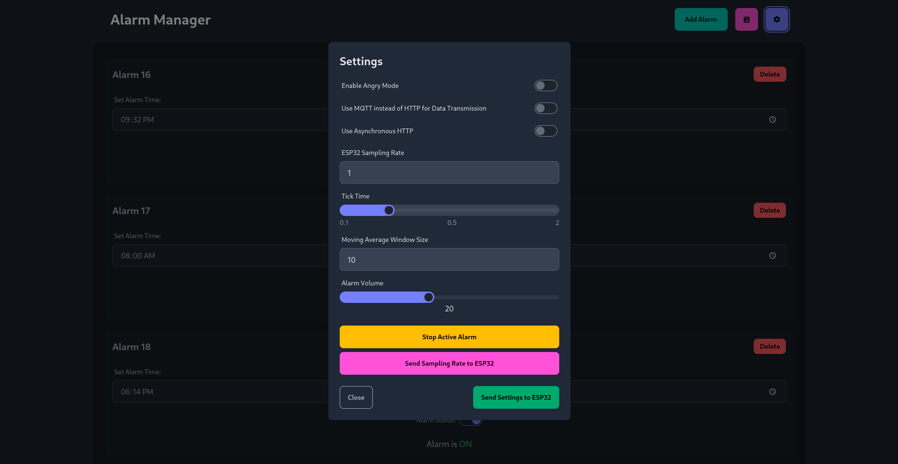

# alarm-thingy

<p align="center">
  
</p>

> "_AAAAAH!_" - this alarm if you won't get up

alarm-thingy is an ESP32-based Smart Alarm that tracks your sleep, and gets angry if you don't get up. Through on a pressure sensor, it can recognize if the user gets out of bed or is taking a snooze, and the alarm will stop if the user stops being lazy and starts their day.
Here are some of the features of this project:
- Beautiful Web App to interact easily with the alarm! Not feeling using the Web App? Check out the Telegram Bot.
- Based on your location and its weather condition, the alarm will play a different, soothing sound.
- Add as many alarms as you want, and decide their weekly pattern. Changed your mind? You can update the alarm on the fly, as soon as you change the values.
- AI-based user detection: through Prophet, you can check the likely-hood of the user being in bed at the current time.
- Easy feedback for the status of the ESP32: depending on its network status, the alarm will play a sound and blink the LED whenever it's successfully sending data to the server.
- Laziness-mitigation technology: if you won't be up by 30 seconds since the start of the alarm, a high-volume metal soundtrack will play.
- No need to setup IPs: the Broker and server will find the alarm by themselves through mDNS.
- Having connection problems? The alarm will reconnect to the server as soon as the connection is available again.
- Lots of statistics in the Web App: View the total sleep time in the last 24h, view the current weather in your location, and more!
- View the current state of the sensor in real-time in the Web App through a Grafana dashboard.
- Switch to HTTP or MQTT on the fly for sending sensor data.
- And much, much more...

More information can be found in the `docs/report.pdf` file.

Click the following link to watch a video demo of the project's features:
[](https://www.youtube.com/watch?v=afLa9XW69rA)
(Please, ignore my thick accent/bad english in the video, I was really tired. I swear I speak much better normally)

----
## Setup instructions
### Software
#### InfluxDB
To setup InfluxDB, you'll first need to log in to the frontend using the default credentials (username:`admin`, password:`admin123`). Afterwards, you'll need to create and copy a secret token. Said token must be inserted into 3 different filenames.
- `backend_secrets.py`, which must be inserted into the `backend` folder.
- `analysis_secrets,py`, which must be inserted into the `data_analysis` folder.

In each file, you'll have to create Python variable named `influxdb_api_token`.
e.g. `influxdb_api_token = "[your_token_here]"`

#### Grafana
The Grafana environment is already set up using automatically by the files into the `grafana` folder and the Docker compose.

> [!WARNING]
> You may need to change the permission of Grafana's data folder for it to work properly.
> To do that, simply run the command:
> `chown -R $USER grafana/data  && chmod -R 777 grafana/data`

#### Secrets
You'll have to setup 2 additional secrets files:
- `esp_secrets.py`, in the `esp32` folder. This file must contain 2 variables named `WIFI_SSID` and `WIFI_PASSWORD` respectively.
    - e.g. `WIFI_SSID = "my_wifi_ssid"` and `WIFI_PASSWORD = "my_wifi_password"`
- `telegram_secrets.py`, in the `telegram_bot` folder. This file should contain the Telegram Bot token inside of a variable called `TELEGRAM_BOT_TOKEN`.
    - e.g. `TELEGRAM_BOT_TOKEN = "[your_token_here]"`

#### AI model
To enable the AI features, you'll need to run the `train_fake_model.py` script from the `data_analysis` folder.
```
python train_fake_model.py
```
This will output the model weights trained on a synthetic dataset in which the user's habits consists on sleeping from 9PM to 5AM.
You can also train a model on real data using the `train_data_from_influxdb.py` script to extract the data from InfluxDB and then use the `train_model.py` script to train the model on the InfluxDB data.

### Hardware
#### Circuit schematics
Here are the schematics on how to setup the speaker and DFPlayer Mini module with to interface with the ESP32.
<p align="center">
  
</p>
In addition, you need add a LED on pin 23 and the pressure mat on pin 18. However, those can be customized based on the user's preferences.

#### SD Card
To make the ESP32 actually play some sounds, you'll need a MicroSD card. Insert it to your PC and add to it 7 different mp3 files which correspond to each chime that you want your ESP32 to play.

---
## How to start
1. Use the `docker-compose` file provided in the repository, and start the infrastructure with the following command:
```
docker-compose up --build
```
2. In addition, you'll need to upload the ESP32 firmware to the ESP32 itself using something like [Pymakr](https://docs.pycom.io/pybytes/pymakr-online/). There is also a handy [VS Code extension](https://docs.pycom.io/gettingstarted/software/vscode/).
3. Finally, start the backend server using the following command in the root of the project folder:
```
python backend/server.py
```

Aaaand... you're done! Enjoy your smart alarm experience!

To view the Grafana dashboards, navigate to `localhost:3001`, and for the Web App, visit `localhost:3000`.

## Accuracy script
To run the accuracy script, make sure that the InfluxDB instance is up and running. Then, simply use the script in this way:
```
python sleep_accuracy.py [hours slept]
```
E.g. `python sleep_accuracy.py 8.0`

---
## Screenshots
<p align="center">
  
</p>
<p align="center">
  
</p>
<p align="center">
  
</p>

---
### Resources
This DFPlayer Mini MicroPython library was used from here: https://github.com/lavron/micropython-dfplayermini. It was very handy for this project.